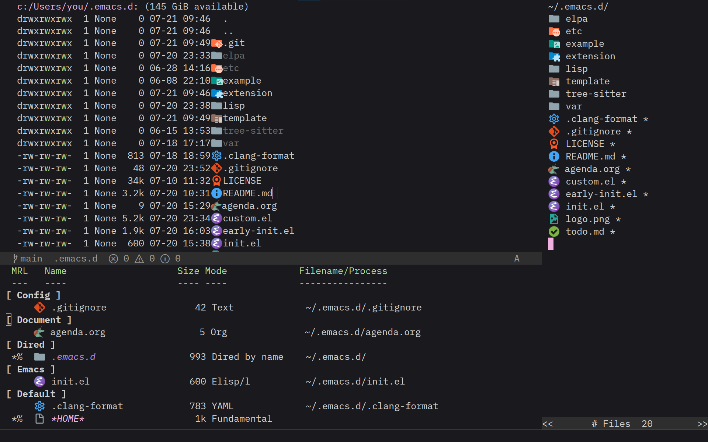

* Material Icon Theme for Emacs

Material Icon Theme integration for Emacs.  Port of the popular
[[https://github.com/material-extensions/vscode-material-icons-theme][vscode-material-icons-theme]] extension — display SVG file-type
and folder-type icons in Dired, Ibuffer, and Speedbar buffers.

** Features
- File-type icons in Dired (~material-icons-dired-icons-mode~)
- File-type icons in Ibuffer (~material-icons-ibuffer-icons-mode~)
- Folder and file icons in Speedbar (~material-icons-speedbar-icons-mode~)

** Installation

[[https://melpa.org/#/material-icons][Now available MELPA.]]

#+begin_src elisp
(use-package material-icons
  :hook
  (dired-mode . material-icons-dired-icons-mode)
  (ibuffer-mode . material-icons-ibuffer-icons-mode)
  :init
  (setq material-icons-size 22)
  (with-eval-after-load 'speedbar
    (material-icons-speedbar-icons-mode 1)))
#+end_src

** Customization

- ~material-icons-size~ — Icon size in pixels (default: frame character height).
- ~material-icons-cache~ — Image cache; cleared automatically on size change.
